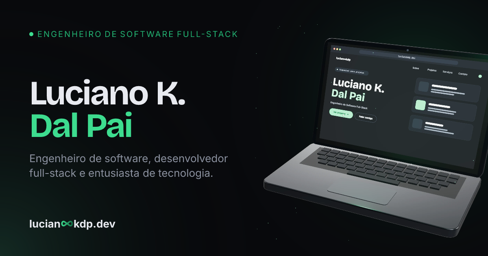

# Luciano K. Dal Pai — Portfolio



**[lucianookdp.dev](https://lucianookdp.dev)**

[](https://github.com/lucianookdp/portfolio-lucianookdp/actions/workflows/deploy.yml)
[](./LICENSE)
[](https://astro.build)

Personal portfolio — editorial typography, a WebGL shader hero, PT/EN
content, and a `⌘K` command palette. Fully static, deployed to a custom
domain.

## Highlights

- Custom WebGL gradient shader in the hero, reactive to cursor movement
- PT/EN content with proper `hreflang` and i18n routing
- `⌘K` command palette for navigation and quick actions
- Smooth cross-fade page transitions
- Live GitHub activity, fetched from the API at build time
- Dark/light theme with a circular reveal transition

## Stack

Astro · TypeScript · Tailwind CSS · React (islands) · Motion · OGL

## Running locally

```bash
npm install
npm run dev
```

```bash
npm run build   # build the static site
npm run preview # preview the production build
npm run check   # type-check
```

## License

MIT — see [LICENSE](./LICENSE).
